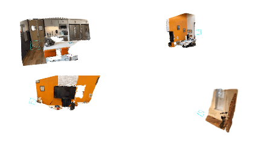

<!-- PROJECT LOGO -->

<p align="center">

  <h1 align="center">SplaTAM: Splat, Track & Map 3D Gaussians for Dense RGB-D SLAM</h1>
  <h3 align="center">CVPR 2024</h3>
  <p align="center">
    <a href="https://nik-v9.github.io/"><strong>Nikhil Keetha</strong></a>
    ·
    <a href="https://jaykarhade.github.io/"><strong>Jay Karhade</strong></a>
    ·
    <a href="https://krrish94.github.io/"><strong>Krishna Murthy Jatavallabhula</strong></a>
    ·
    <a href="https://gengshan-y.github.io/"><strong>Gengshan Yang</strong></a>
    ·
    <a href="https://theairlab.org/team/sebastian/"><strong>Sebastian Scherer</strong></a>
    <br>
    <a href="https://www.cs.cmu.edu/~deva/"><strong>Deva Ramanan</strong></a>
    ·
    <a href="https://www.vision.rwth-aachen.de/person/216/"><strong>Jonathon Luiten</strong></a>
  </p>
  <h3 align="center"><a href="https://arxiv.org/pdf/2312.02126.pdf">Paper</a> | <a href="https://youtu.be/jWLI-OFp3qU">Video</a> | <a href="https://spla-tam.github.io/">Project Page</a></h3>
  <div align="center"></div>
</p>

<p align="center">
  <a href="">
    
  </a>
</p>

<br>

## Stay Tuned for a Faster and Better Variant of SplaTAM! 

<!-- TABLE OF CONTENTS -->
<details open="open" style='padding: 10px; border-radius:5px 30px 30px 5px; border-style: solid; border-width: 1px;'>
  <summary>Table of Contents</summary>
  <ol>
    <li>
      <a href="#installation">Installation</a>
    </li>
    <li>
      <a href="#demo">Online Demo</a>
    </li>
    <li>
      <a href="#usage">Usage</a>
    </li>
    <li>
      <a href="#downloads">Downloads</a>
    </li>
    <li>
      <a href="#benchmarking">Benchmarking</a>
    </li>
    <li>
      <a href="#acknowledgement">Acknowledgement</a>
    </li>
    <li>
      <a href="#citation">Citation</a>
    </li>
    <li>
      <a href="#developers">Developers</a>
    </li>
  </ol>
</details>

## Installation

##### (Recommended)
SplaTAM has been tested on python 3.10, CUDA>=11.6. The simplest way to install all dependences is to use [anaconda](https://www.anaconda.com/) and [pip](https://pypi.org/project/pip/) in the following steps: 

```bash
conda create -n splatam python=3.10
conda activate splatam
conda install -c "nvidia/label/cuda-11.6.0" cuda-toolkit
conda install pytorch==1.12.1 torchvision==0.13.1 torchaudio==0.12.1 cudatoolkit=11.6 -c pytorch -c conda-forge
pip install -r requirements.txt
```

<!-- Alternatively, we also provide a conda environment.yml file :
```bash
conda env create -f environment.yml
conda activate splatam
``` -->

#### Windows

For installation on Windows using Git bash, please refer to the [instructions shared in Issue#9](https://github.com/spla-tam/SplaTAM/issues/9#issuecomment-1848348403).

#### Docker and Singularity Setup

We also provide a docker image. We recommend using a venv to run the code inside a docker image:


```bash
docker pull nkeetha/splatam:v1
bash bash_scripts/start_docker.bash
cd /SplaTAM/
pip install virtualenv --user
mkdir venv
cd venv
virtualenv --system-site-packages splatam
source ./splatam/bin/activate
pip install -r venv_requirements.txt
```

Setting up a singularity container is similar:
```bash
cd </path/to/singularity/folder/>
singularity pull splatam.sif docker://nkeetha/splatam:v1
singularity instance start --nv splatam.sif splatam
singularity run --nv instance://splatam
cd <path/to/SplaTAM/>
pip install virtualenv --user
mkdir venv
cd venv
virtualenv --system-site-packages splatam
source ./splatam/bin/activate
pip install -r venv_requirements.txt
```

## Demo

### Online

You can SplaTAM your own environment with an iPhone or LiDAR-equipped Apple device by downloading and using the <a href="https://apps.apple.com/au/app/nerfcapture/id6446518379">NeRFCapture</a> app.

Make sure that your iPhone and PC are connected to the same WiFi network, and then run the following command:

 ```bash
bash bash_scripts/online_demo.bash configs/iphone/online_demo.py
```

On the app, keep clicking send for successive frames. Once the capturing of frames is done, the app will disconnect from the PC and check out SplaTAM's interactive rendering of the reconstruction on your PC! Here are some cool example results:

<p align="center">
  <a href="">
    
  </a>
</p>

### Offline

You can also first capture the dataset and then run SplaTAM offline on the dataset with the following command:

```bash
bash bash_scripts/nerfcapture.bash configs/iphone/nerfcapture.py
```

### Dataset Collection

If you would like to only capture your own iPhone dataset using the NeRFCapture app, please use the following command:

```bash
bash bash_scripts/nerfcapture2dataset.bash configs/iphone/dataset.py
```

## Usage

We will use the iPhone dataset as an example to show how to use SplaTAM. The following steps are similar for other datasets.

To run SplaTAM, please use the following command:

```bash
python scripts/splatam.py configs/iphone/splatam.py
```

To visualize the final interactive SplaTAM reconstruction, please use the following command:

```bash
python viz_scripts/final_recon.py configs/iphone/splatam.py
```

To visualize the SplaTAM reconstruction in an online fashion, please use the following command:

```bash
python viz_scripts/online_recon.py configs/iphone/splatam.py
```

To export the splats to a .ply file, please use the following command:

```bash
python scripts/export_ply.py configs/iphone/splatam.py
```

`PLY` format Splats can be visualized in viewers such as [SuperSplat](https://playcanvas.com/supersplat/editor) & [PolyCam](https://poly.cam/tools/gaussian-splatting).

To run 3D Gaussian Splatting on the SplaTAM reconstruction, please use the following command:

```bash
python scripts/post_splatam_opt.py configs/iphone/post_splatam_opt.py
```

To run 3D Gaussian Splatting on a dataset using ground truth poses, please use the following command:

```bash
python scripts/gaussian_splatting.py configs/iphone/gaussian_splatting.py
```

## Downloads

DATAROOT is `./data` by default. Please change the `input_folder` path in the scene-specific config files if datasets are stored somewhere else on your machine.

### Replica

Download the data as below, and the data is saved into the `./data/Replica` folder. Note that the Replica data is generated by the authors of iMAP (but hosted by the authors of NICE-SLAM). Please cite iMAP if you use the data.

```bash
bash bash_scripts/download_replica.sh
```

### TUM-RGBD

```bash
bash bash_scripts/download_tum.sh
```

### ScanNet

Please follow the data downloading procedure on the [ScanNet](http://www.scan-net.org/) website, and extract color/depth frames from the `.sens` file using this [code](https://github.com/ScanNet/ScanNet/blob/master/SensReader/python/reader.py).

<details>
  <summary>[Directory structure of ScanNet (click to expand)]</summary>

```
  DATAROOT
  └── scannet
        └── scene0000_00
            └── frames
                ├── color
                │   ├── 0.jpg
                │   ├── 1.jpg
                │   ├── ...
                │   └── ...
                ├── depth
                │   ├── 0.png
                │   ├── 1.png
                │   ├── ...
                │   └── ...
                ├── intrinsic
                └── pose
                    ├── 0.txt
                    ├── 1.txt
                    ├── ...
                    └── ...
```
</details>


We use the following sequences: 
```
scene0000_00
scene0059_00
scene0106_00
scene0181_00
scene0207_00
```

### ScanNet++

Please follow the data downloading and image undistortion procedure on the <a href="https://kaldir.vc.in.tum.de/scannetpp/">ScanNet++</a> website. 
Additionally for undistorting the DSLR depth images, we use our <a href="https://github.com/Nik-V9/scannetpp">own variant of the official ScanNet++ processing code</a>. We will open a pull request to the official ScanNet++ repository soon.

We use the following sequences: 

```
8b5caf3398
b20a261fdf
```

For b20a261fdf, we use the first 360 frames, due to an abrupt jump/teleportation in the trajectory post frame 360. Please note that ScanNet++ was primarily intended as a NeRF Training & Novel View Synthesis dataset.

### Replica-V2

We use the Replica-V2 dataset from vMAP to evaluate novel view synthesis. Please download the pre-generated replica sequences from <a href="https://github.com/kxhit/vMAP">vMAP</a>.

## Benchmarking

For running SplaTAM, we recommend using [weights and biases](https://wandb.ai/) for the logging. This can be turned on by setting the `wandb` flag to True in the configs file. Also make sure to specify the path `wandb_folder`. If you don't have a wandb account, first create one. Please make sure to change the `entity` config to your wandb account. Each scene has a config folder, where the `input_folder` and `output` paths need to be specified. 

Below, we show some example run commands for one scene from each dataset. After SLAM, the trajectory error will be evaluated along with the rendering metrics. The results will be saved to `./experiments` by default.

### Replica

To run SplaTAM on the `room0` scene, run the following command:

```bash
python scripts/splatam.py configs/replica/splatam.py
```

To run SplaTAM-S on the `room0` scene, run the following command:

```bash
python scripts/splatam.py configs/replica/splatam_s.py
```

For other scenes, please modify the `configs/replica/splatam.py` file or use `configs/replica/replica.bash`.

### TUM-RGBD

To run SplaTAM on the `freiburg1_desk` scene, run the following command:

```bash
python scripts/splatam.py configs/tum/splatam.py
```

For other scenes, please modify the `configs/tum/splatam.py` file or use `configs/tum/tum.bash`.

### ScanNet

To run SplaTAM on the `scene0000_00` scene, run the following command:

```bash
python scripts/splatam.py configs/scannet/splatam.py
```

For other scenes, please modify the `configs/scannet/splatam.py` file or use `configs/scannet/scannet.bash`.

### ScanNet++

To run SplaTAM on the `8b5caf3398` scene, run the following command:

```bash
python scripts/splatam.py configs/scannetpp/splatam.py
```

To run Novel View Synthesis on the `8b5caf3398` scene, run the following command:

```bash
python scripts/eval_novel_view.py configs/scannetpp/eval_novel_view.py
```

For other scenes, please modify the `configs/scannetpp/splatam.py` file or use `configs/scannetpp/scannetpp.bash`.

### ReplicaV2

To run SplaTAM on the `room0` scene, run the following command:

```bash
python scripts/splatam.py configs/replica_v2/splatam.py
```

To run Novel View Synthesis on the `room0` scene post SplaTAM, run the following command:

```bash
python scripts/eval_novel_view.py configs/replica_v2/eval_novel_view.py
```

For other scenes, please modify the config files.

## Acknowledgement

We thank the authors of the following repositories for their open-source code:

- 3D Gaussians
  - [Dynamic 3D Gaussians](https://github.com/JonathonLuiten/Dynamic3DGaussians)
  - [3D Gaussian Splating](https://github.com/graphdeco-inria/gaussian-splatting)
- Dataloaders
  - [GradSLAM & ConceptFusion](https://github.com/gradslam/gradslam/tree/conceptfusion)
- Baselines
  - [Nice-SLAM](https://github.com/cvg/nice-slam)
  - [Point-SLAM](https://github.com/eriksandstroem/Point-SLAM)

## Citation

If you find our paper and code useful, please cite us:

```bib
@inproceedings{keetha2024splatam,
        title={SplaTAM: Splat, Track & Map 3D Gaussians for Dense RGB-D SLAM},
        author={Keetha, Nikhil and Karhade, Jay and Jatavallabhula, Krishna Murthy and Yang, Gengshan and Scherer, Sebastian and Ramanan, Deva and Luiten, Jonathon},
        booktitle={Proceedings of the IEEE/CVF Conference on Computer Vision and Pattern Recognition},
        year={2024}
      }
```

## Developers
- [Nik-V9](https://github.com/Nik-V9) ([Nikhil Keetha](https://nik-v9.github.io/))
- [JayKarhade](https://github.com/JayKarhade) ([Jay Karhade](https://jaykarhade.github.io/))
- [JonathonLuiten](https://github.com/JonathonLuiten) ([Jonathan Luiten](https://www.vision.rwth-aachen.de/person/216/))
- [krrish94](https://github.com/krrish94) ([Krishna Murthy Jatavallabhula](https://krrish94.github.io/))
- [gengshan-y](https://github.com/gengshan-y) ([Gengshan Yang](https://gengshan-y.github.io/))
